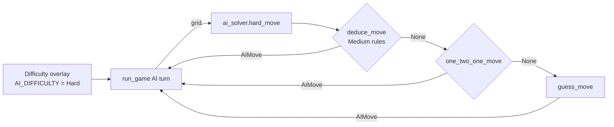

# Hard AI Solver — Architecture

Authors: Marcos Lepage, Jal Maru · Last updated: 2026-10-10

## What it does

The Hard AI uses everything the Medium AI does (see [`medium-ai.md`](medium-ai.md)) and adds the **1-2-1 pattern**. Like Medium, it only uses what a human can see (revealed cells, flags and numbers), never reads `Cell.has_mine`, and makes **one** action per turn. Each turn it picks the first rule below that applies:

| Order | Rule | Condition | Action |
|---|---|---|---|
| 1 | Flag by count (`flag-count`) | Same as Medium | Flag one unflagged covered neighbor |
| 2 | Open by count (`open-count`) | Same as Medium | Open one unflagged covered neighbor |
| 3 | 1-2-1 pattern (`one-two-one`) | Three side-by-side revealed numbers read 1-2-1, and all of their unflagged covered neighbors lie in one line beside them | Open the cell across from the 2, then flag the cells across from the 1s |
| 4 | Guess (`guess`) | Nothing above applies | Open a random covered, unflagged cell |

## The 1-2-1 pattern

```
  a  b  c  d  e      <- line of covered cells (a and e may be revealed or off the board)
     1  2  1         <- three revealed numbers side by side
  (everything else around the 1-2-1 is revealed or off the board)
```

Each number counts the mines in the cells of the line it touches:

- left 1: `a + b + c = 1`
- middle 2: `b + c + d = 2`
- right 1: `c + d + e = 1`

Subtracting the left equation from the middle one gives `d − a = 1`, so `d = 1` and `a = 0`. Subtracting the right equation from the middle one gives `b − e = 1`, so `b = 1` and `e = 0`. The left 1 then forces `c = 0`. So **b and d are mines and c is safe**. This is the deduction the assignment describes: the two outer hidden neighbors are mines and the inner one is safe.

### Conditions checked by `one_two_one_move`

1. All three cells are on the board and revealed.
2. Their **effective** numbers are 1, 2, 1. The effective number is the displayed number minus flags already around the cell (`effective_number`). This means a displayed 3-5-3 next to a row of correct flags also counts, and the info bar adds "(3-5-3 minus flags)" when this happens.
3. Every unflagged covered neighbor of the three cells is in the five-cell line beside them. If any unknown cell is elsewhere (for example, the other side is also covered), the equations above have extra unknowns and prove nothing, so the pattern is skipped.
4. The two outer cells (b, d) are still unflagged and covered. If one is not, the board contradicts the pattern (only possible after a wrong player flag), and the pattern is skipped rather than acted on.

It checks all four orientations: a row of numbers with the line above or below it, and a column of numbers with the line to the left or right.

### Move order

The pattern opens the inner safe cell first, since that reveals new information, and then flags an outer mine. After that flag, the 1 next to it has as many flags as its number, so the Medium rules finish the job on the following turns (open the remaining safe cells, flag the other mine). The info bar shows, for example, `Open B1: 1-2-1 at A2-B2-C2`. The blue outline marks the middle 2 and the orange outline marks the target cell.

## Where it lives

| File | Change |
|---|---|
| `ai_solver.py` | Adds `effective_number`, `unknown_neighbors`, `one_two_one_move` and `hard_move`. `hard_move(grid) = deduce_move(grid) or one_two_one_move(grid) or guess_move(grid)`. |
| `executive.py` | Adds `"Hard": ai_solver.hard_move` to `AI_STRATEGIES`. The difficulty screen, turn loop, highlight and info bar were already written for Medium and work unchanged. |



## Measured behavior

2,000 simulated games per row, run headlessly on the 10×10 board with the same safe first click and flood fill as `executive.py`. Medium and Hard start from the same seeds. The simulation also checked that no rule other than a guess flagged a safe cell or opened a mine, that no move was a no-op and that no game looped.

| Mines | Medium win rate | Hard win rate | 1-2-1 moves made |
|---|---|---|---|
| 10 | 91.5% | 93.6% | 105 |
| 15 | 61.3% | 69.3% | 412 |
| 20 | 20.2% | 26.2% | 588 |

No rule made a wrong move in any game. Every loss came from a guess.

## AI attribution

Claude Code (Claude Opus 5.5) helped write `effective_number`, `unknown_neighbors`, `one_two_one_move`, the simulation used for the numbers above, and this document.
