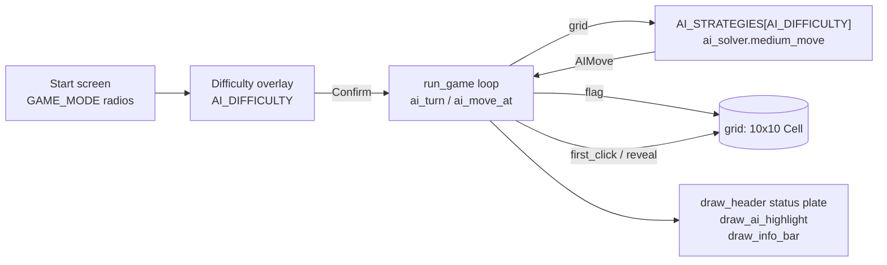

# Medium AI Solver — Architecture

Authors: Axel Bengoa, Adam Darst · Last updated: 2026-10-10

## What it does

The Medium AI plays on the same 10×10 board as the human, using only what a human can see: which cells are revealed, which are flagged, and the numbers on revealed cells. It never reads `Cell.has_mine`. Each turn it makes **one** action, chosen in this order:

| Order | Rule | Condition (for a revealed number *n*) | Action |
|---|---|---|---|
| 1 | Flag by count (`flag-count`) | *n* == number of **covered** neighbors (flagged or not) | Flag one unflagged covered neighbor |
| 2 | Open by count (`open-count`) | *n* == number of **flagged** covered neighbors | Open one unflagged covered neighbor |
| 3 | Guess (`guess`) | No number on the board triggers rule 1 or 2 | Open a random covered, unflagged cell |

## Where it lives

| File | Role |
|---|---|
| `ai_solver.py` | The rules. Pure Python with no pygame and no side effects: reads the grid and returns an `AIMove`. |
| `executive.py` | The turn loop. Asks the selected strategy for a move, applies it (flag or `reveal`/`first_click`), plays sounds, detects win/loss, and draws the highlight and info bar. |
| `cell.py` | Unchanged `Cell` data model (`is_revealed`, `is_flagged`, `adjacent_mines`, `has_mine`). |

### Key data structure: `AIMove`

| Field | Meaning |
|---|---|
| `action` | `"flag"` or `"reveal"` |
| `row`, `col` | Target cell (0-based) |
| `rule` | `"flag-count"`, `"open-count"` or `"guess"` |
| `source` | `(row, col)` of the number that justified the move; `None` for a guess |
| `reason` | Text shown in the info bar, e.g. `Flag A3: A4 is a 1 with 1 covered` (cell names match the A–J / 1–10 board labels) |

`medium_move` returns `None` when no covered, unflagged cell remains. In automatic mode this cannot happen before a win, because the AI only flags real mines. In interactive mode it can happen if the player flagged a safe cell, and the AI then passes the turn back.

## Turn flow

- **AI Mode (Automatic):** after Confirm, `ai_turn` stays `True`. The AI makes the first move (through `first_click`, so it gets the same safe opening as a human), then one action every `AI_MOVE_DELAY` ms. Mouse clicks on the board are ignored.
- **AI Mode (Interactive):** the player moves first. Opening a covered cell passes the turn to the AI, but placing a flag does not, since flags are the player's own notes. The AI makes one action and hands the turn back. The header plate shows `Your Turn` / `AI's Turn`, then the result: `AI Wins!` (the player hit a mine), `You Win!` (the AI hit a mine) or `Both Win!` (board cleared).

## Design decisions

1. **"Hidden" means two different things in the two rules.** In rule 1 it means *covered*, including flagged cells: a flag doesn't change whether a cell is a mine, and excluding flags would stop the rule from firing on numbers that are already partly flagged. In rule 2 the cells to open are the *covered and unflagged* ones, since those are the only cells that can be opened.
2. **One action per turn.** Without this, the AI would clear the board in one frame and there would be nothing to watch. A number whose neighbors need three flags fires rule 1 on three turns in a row.
3. **Never make a no-op move.** A number with no unflagged covered neighbor is skipped, so the AI always changes the board and cannot loop.
4. **Revealed cells are never counted as flags.** The inherited flood fill can reveal a cell that has a flag on it. The solver checks `is_revealed` first, so such a cell is not counted as a flagged mine.
5. **Rules are sound and guesses are the only risk.** Rule 1 is always correct. Rule 2 is correct as long as every flag is correct, which holds in automatic mode because every flag comes from rule 1. In interactive mode a wrong flag placed by the player can lead rule 2 to open a mine.

## Measured behavior

2,000 simulated games per row, run headlessly against the real `first_click`/`reveal` code. The test also asserted that rule 1 never flagged a safe cell, rule 2 never opened a mine, no move was a no-op and no game looped.

| Mines | Medium win rate | Pure random win rate |
|---|---|---|
| 10 | 91.5% | 0.0% |
| 15 | 60.1% | 0.0% |
| 20 | 19.1% | 0.0% |

Every Medium loss comes from a guess. Results vary by a few percent from run to run.

## Extending it

- **Add a difficulty:** write a function `grid -> AIMove | None` in `ai_solver.py` and register it in `AI_STRATEGIES` in `executive.py`. The turn loop, highlight and info bar work for it without changes. A difficulty missing from `AI_STRATEGIES` leaves the AI idle, and the game plays like Manual mode.
- **Hard (1-2-1 pattern):** `medium_move` is `deduce_move(grid) or guess_move(grid)`. Hard is the same function with a pattern check in between: `deduce_move(grid) or one_two_one_move(grid) or guess_move(grid)`.
- **Speed:** `AI_MOVE_DELAY` in `executive.py` (ms between AI actions).

## AI attribution

Adam Darst wrote the original rule loop (`ai_solver_step` in `executive.py`, commit `f212149`). Claude Code (Claude Opus 5.5) helped move it into `ai_solver.py`, add the move explanations, the turn loop, the highlight and info bar, and the simulation used for the numbers above. Sections in the code are marked *Combined*.
